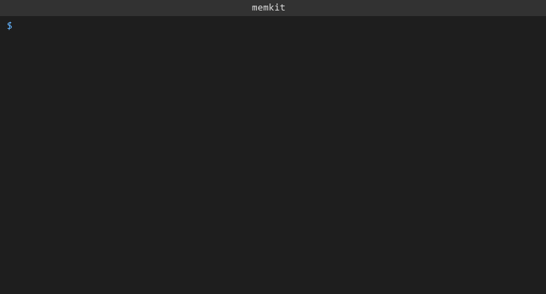

 

# MemKit — Markdown-Native Agent Memory Store


> **Video walkthrough:** https://youtu.be/NxUClNFsEww
> **60-second overview:** https://youtu.be/60-Ro6KX_Y8

> A local-first semantic memory layer for LLM agents: store and retrieve Markdown memories via REST API, no cloud required.



## What it is

MemKit is a self-hosted memory backend for LLM agents and AI pipelines. It solves a universal pain point: agents that forget everything between sessions, or that depend on paid external vector stores. Memories are plain Markdown snippets, optionally annotated with YAML front-matter (`tags`, `source`, `created_at`). MemKit embeds them locally using `sentence-transformers` (CPU-friendly, no API key needed) and persists vectors in ChromaDB on disk.

A FastAPI server exposes a clean REST API so any agent framework — LangChain, LlamaIndex, raw HTTP calls — can read and write memories with zero extra dependencies. A Typer CLI and a Python client class are included for direct use. The server survives process restarts; there is no external database process to manage.

## Quickstart

```bash
git clone https://github.com/RitikPatill/memkit-agent-memory.git
cd memkit-agent-memory
pip install -r requirements.txt
pip install -e .

# Start the server (choose one)
docker compose up                          # recommended
uvicorn memkit.server:app --reload         # without Docker
```

The server starts on `http://localhost:8000`. The first run downloads the `all-MiniLM-L6-v2` model (~80 MB).

## Usage

Store a memory and retrieve it semantically using the CLI:

```bash
memkit add "The user prefers concise, bullet-point answers."
memkit add path/to/notes.md          # Markdown file with optional YAML front-matter
memkit search "how should I format responses" --k 3
memkit list
```

The same operations are available over HTTP:

```bash
curl -s -X POST http://localhost:8000/memories \
     -H "Content-Type: application/json" \
     -d '{"text": "The user prefers concise answers."}'

curl -s "http://localhost:8000/memories/search?q=how+should+I+respond&k=3"
```

`examples/chatbot.py` shows a complete integration: it retrieves the top-3 relevant memories on each turn and injects them as a system prompt before calling the Anthropic API.

```bash
ANTHROPIC_API_KEY=sk-... python examples/chatbot.py
```

## Architecture

```
┌──────────────────────────────────────────────────┐
│  CLI (memkit add / search / list)                │
│  MemKitClient  (Python, httpx)                   │
│  Raw HTTP caller (curl, any agent framework)     │
│           │                                      │
│           ▼                                      │
│     FastAPI server  :8000                        │
│           │                                      │
│           ▼                                      │
│      MemoryStore                                 │
│      ├── sentence-transformers                   │
│      │   (all-MiniLM-L6-v2, 384-dim, CPU)       │
│      └── ChromaDB  (./chroma_data/, disk)        │
└──────────────────────────────────────────────────┘
```

## Project structure

```
memkit-agent-memory/
├── src/memkit/          Core package: store, server, client, cli, config
├── tests/               pytest suite covering store, server, client, CLI
├── examples/            Memory-augmented chatbot (Anthropic API)
├── demo/                Terminal demo recording (GIF + VHS tape)
├── .github/workflows/   GitHub Actions CI
├── Dockerfile           Container image definition
├── docker-compose.yml   One-command server startup with volume mount
├── pyproject.toml       Package metadata and memkit entry-point
└── requirements.txt     Pinned runtime dependencies
```

## Roadmap

- [ ] Async Python client for use inside async agent frameworks
- [ ] Bulk import from a directory of Markdown files
- [ ] Optional cross-encoder re-ranking pass for higher-precision retrieval
- [ ] OpenAI-compatible embedding endpoint for drop-in backend swapping
- [ ] Minimal web UI for browsing and editing stored memories

## License

MIT — see [LICENSE](LICENSE).

---

Built autonomously by [autodev](https://github.com/RitikPatill/autodev),
a multi-agent orchestrator I designed. Each commit in this repo was
authored by me; the implementation work was performed by Sonnet under
the orchestrator's control. Read the orchestrator's README to see how.
